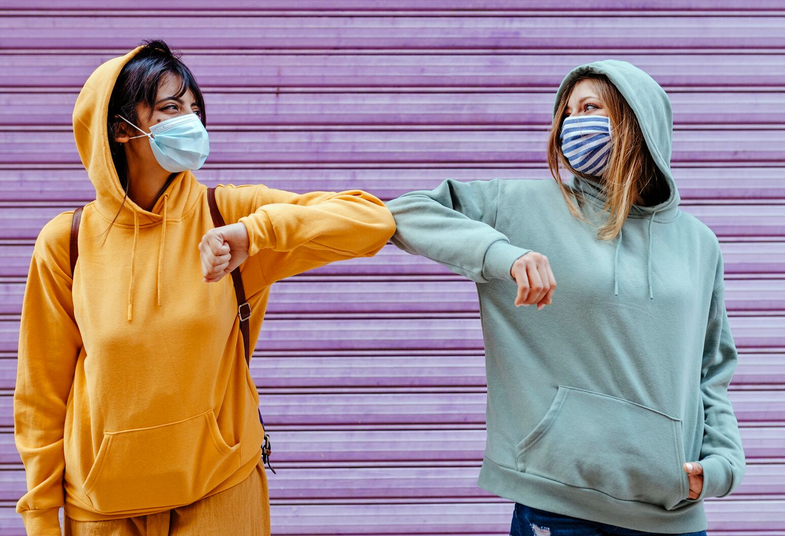
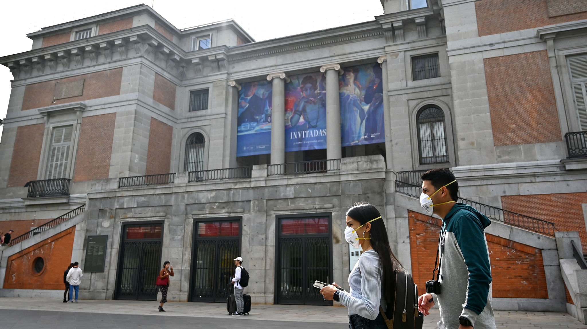

# Face-Mask Detection

    
    
    
### :woman_technologist: Introduction

In the COVID-19 crisis wearing masks is absolutely necessary for public health and in terms of controlling the spread of the pandemic. 
This project's aim is to develop a system that could detect masked and unmasked faces in images and real-time video. This can, for example, be used to alert people that do not wear a mask when using the public transport or in a Theatre.

